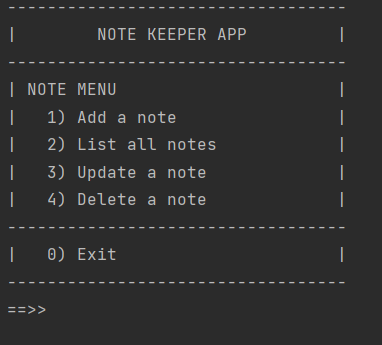

# RugbyClubV2

- This project is about a fictional rugby club. You can create, read, update, delete and search for players. This project has an auto incrementing playerID. I have used two type of persistance using XML or JSON 
- Language - Kotlin

